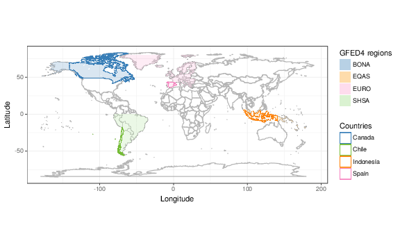
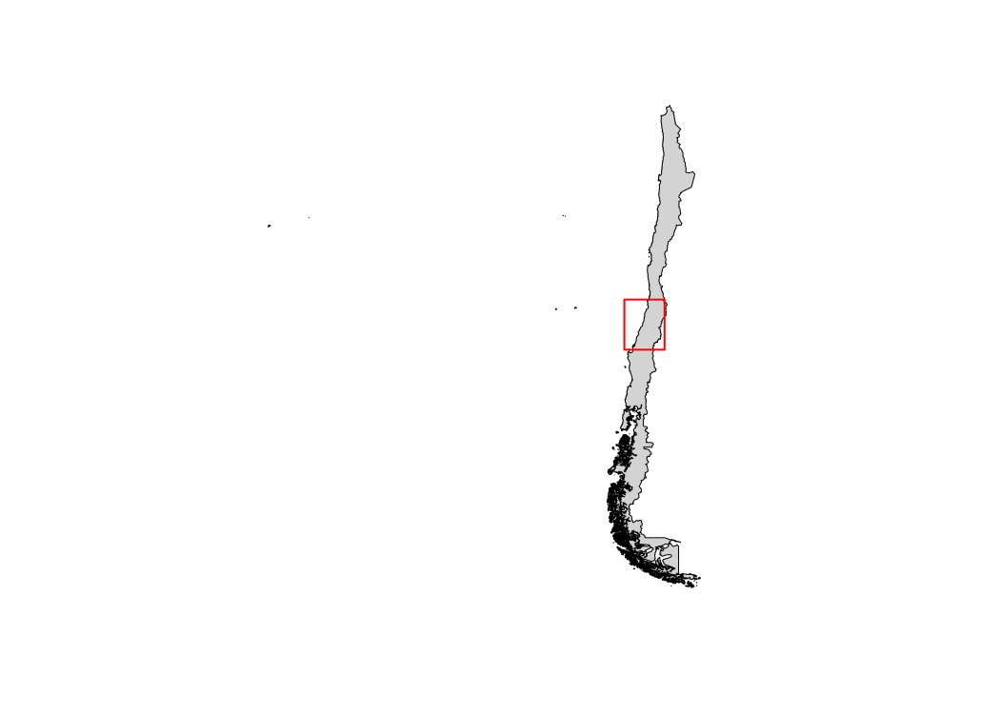
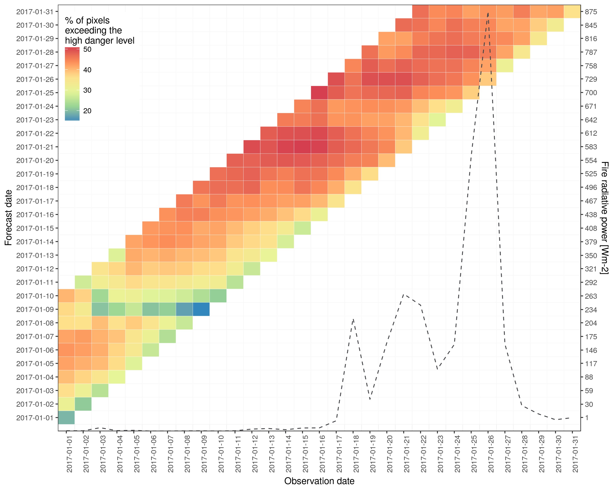

```{r setup, include=FALSE}
knitr::opts_chunk$set(echo = TRUE,
                      eval = FALSE)
```

The package caliver contains functions for the calibration and verification of gridded model outputs. The package was designed with a fire risk model in mind (GEFF) but, in the near future, this is going to develop in a model agnostic tool. The introductory vignette "An introduction to the caliver package" and [@vitolo:2018] contain a detailed description of the main functionalities of this package. The goal of this vignette, instead, is to describe how to use caliver to calculate and verify fire danger classes based on user-defined areas. This vignette contains the code to run all the analyses in [@digiuseppe:2018], please refer to this paper for more information on the methodology.

## R package caliver

For information on how to install and load caliver, please refer to the vignette "An introduction to the caliver package" and the README file in the repository.

```{r}
# Install caliver from GitHub
devtools::install_github("ecmwf/caliver")
```

```{r}
library("caliver")
library("raster")
library("ggplot2")
library("verification")
library("rowr")
library("dplyr")
library("rgeos")
library("maptools")
library("RColorBrewer")
```

## Get data

#### GFED4 areas and countries of interest 

We will demonstrate how to calculate and validate fire danger levels for 4 GFED4 areas and countries: 

- Europe (EURO) and Portugal,
- Temperate North America (TENA) and California,
- Southern Hemisphere South America (SHSA) and Chile.

```{r}
regions <- c("BONA", "TENA", "CEAM", "NHSA", "SHSA", "EURO", "MIDE", "NHAF",
             "SHAF", "BOAS", "CEAS", "SEAS", "EQAS", "AUST")
zones <- c("north", "north", "tropics", "tropics", "south", "north", "north",
           "tropics", "south", "north", "north", "tropics", "tropics", "south")

# GFED4 regions of interest
EURO <- get_gfed4(varname = "BasisRegions", region = "EURO")
TENA <- get_gfed4(varname = "BasisRegions", region = "EQAS")
SHSA <- get_gfed4(varname = "BasisRegions", region = "SHSA")

BasisRegions <- get_gfed4(varname = "BasisRegions")
BasisRegions@data$id <- 1:nrow(BasisRegions@data)   # add id column for join
regionXFort <- fortify(BasisRegions, data = BasisRegions@data)
regionXPoly <- merge(regionXFort, BasisRegions@data, 
                     by.x = "id", by.y = "id")  # join data
#regionXPoly$Region <- region

ggplot(aes(x = long, y = lat), data = map_data("world")) +
  geom_polygon(aes(group = group), fill=NA, colour = "grey65") +
  coord_equal() +  theme_bw() + xlab("Longitude") + ylab("Latitude") +
  geom_polygon(data = regionXPoly,
               aes(x = long, y = lat, group = group, fill = factor(layer)),
               alpha = 0.5) +
  scale_fill_manual(name="GFED4 regions",
                    # values = viridis::viridis(14),
                    values = c("darkgrey",
                               RColorBrewer::brewer.pal(12,"Paired"),
                               "lightgrey"),
                    labels = regions) + 
  geom_polygon(data = map_data("world", region = "Portugal"),
               aes(x = long, y = lat, group = group, colour = "Portugal"), 
               fill = NA) +
  geom_polygon(data = map_data("world", region = "Chile"),
               aes(x = long, y = lat, group = group, colour = "Chile"), 
               fill = NA) +
  geom_polygon(data = map_data(map = "state", region = "California"),
               aes(x = long, y = lat, group = group, colour = "California"), 
               fill = NA) +
  scale_colour_manual(name = "Study areas",
                      values = c("Portugal" = "brown",
                                 "California" = "darkblue",
                                 "Chile" = "darkgreen")) +
  scale_x_continuous(limits = c(-180, +180), expand = c(0, 0)) +
  scale_y_continuous(limits = c(-85, +85), expand = c(0, 0))

ggsave(file = "figures/world.png", plot = worldcountries,
       device = cairo_ps, fallback_resolution = 600,
       width = unit(1050, "px"), height = unit(750, "px"))
```

Plot areas and countries of interest (Fig.1).



#### Reanalysis data

For a matter of consistency with the introductory vignette, we will use the FWI as index to estimate the fire danger classes. The first step is to download, from the [GEFF-reanalysis web app](http://apps.ecmwf.int/datasets/data/geff-reanalysis/), reanalysis data from 1980 to 2016. Assuming that data is downloaded in the folder "reanalysis" of the working directory, we can use `stack_netcdf_files()` to aggregate all the files into one netcdf file (this is not necessary if you have run through the examples in the intro vignette) and load it as RasterBrick. See the introductory vignette for more information.

```{r}
# FWI reanalysis dataset, GEFF reanalysis v2.0
FWI <- brick("../geff/reanalysis/fwi.nc") # 7GB!
FWI <- brick(FWI[[1:(nlayers(FWI)-365)]]) #only 1980-2016
```

## Calculate fire danger classes by GFED4 areas and countries

Calculate fire danger classes as shown in the introductory vignette.

```{r}
# Define a vector with a sequence of dates related to the reanalysis
dataDates <- seq.Date(from = as.Date("1980-01-01"),
                      to = as.Date("2016-12-31"),
                      by = "day")

# Initialise empty matrix to store thresholds
df <- matrix(data = NA, nrow = 0, ncol = 6)

# Mask/Crop/Subset FWI and generate thresholds for each GFED4 region
for (i in seq_along(regions)) {
  print(i)
  region <- regions[i]
  regionPoly <- get_gfed4(varname = "BasisRegions", region = region)
  season <- which(get_fire_season(dates = dataDates, zone = zones[i]) == TRUE)
  regionR <- mask_crop_subset(r = FWI, p = regionPoly, idx = season)
  df <- rbind(df, c(region, get_fire_danger_levels(fire_index = regionR)))
}

df <- data.frame(df, stringsAsFactors = FALSE)
names(df) <- c("Location", "Low", "Moderate", "High", "Very high", "Extreme")
df[] <- lapply(X = df, FUN = as.character)
df[2:6] <- lapply(X = df[2:6], FUN = as.numeric)

# Mask/Crop/Subset FWI and generate thresholds for each country of interest
listOfPlots <- list()
countries <- c("Portugal", "Chile")
zonescountries <- c("north", "south")
regionData <- list()
for (i in seq_along(countries)) {
  region <- countries[i]
  regionPoly <- raster::getData(name = "GADM", country = region, level = 0)
  season <- which(get_fire_season(dates = dataDates, zone = zonescountries[i]) == TRUE)
  regionR <- mask_crop_subset(r = FWI, p = regionPoly, idx = season)
  df <- rbind(df, c(region, get_fire_danger_levels(fire_index = regionR)))
  percs <- round(quantile(na.omit(as.vector(regionR)), 
                        probs = c(0.70, 0.90, 0.98)), 0)
  # Density plot with thresholds
  listOfPlots[[i]] <- plot_fire_pdf(fire_index = regionR,
                     thresholds = as.numeric(df[which(df[,1]== region), 2:6]),
                     upper_limit = 110,
                     v_lines = percs)
  regionData[[i]] <- na.omit(as.vector(regionR))
}

regionPoly <- raster::getData(name = "GADM", country = "USA", level = 1)[6,]
season <- which(get_fire_season(dates = dataDates, zone = "north") == TRUE)
regionR <- mask_crop_subset(r = FWI, p = regionPoly, idx = season)
df <- rbind(df, c("California", get_fire_danger_levels(fire_index = regionR)))
percs <- round(quantile(na.omit(as.vector(regionR)),
                        probs = c(0.70, 0.90, 0.98)), 0)
# Density plot with thresholds
listOfPlots[[3]] <- plot_fire_pdf(fire_index = regionR,
                     thresholds = as.numeric(df[which(df[,1]== "California"), 2:6]),
                     upper_limit = 110,
                     v_lines = percs)
regionData[[3]] <- na.omit(as.vector(regionR))

regionDF <- cbind.fill(regionData[[1]], regionData[[2]], regionData[[3]], fill = NA)
names(regionDF) <- c("Portugal", "Chile", "California")

# saveRDS(regionDF, "regionDF.rds")
# saveRDS(df, "thresholds_geff.rds")
# df <- readRDS("thresholds_geff.rds")
knitr::kable(df, row.names = FALSE)

ggsave(file = paste0(region, "PDF2.eps"),
       plot = listOfPlots[[i]], width=unit(8, "in"), height=unit(5, "in"))
```

## POD by GFED4 regions

It is interesting to try and understand whether there is a higher POD in some areas compared to others. In order to assess this, we proceed as follows:

* use the previously calculated regional thresholds
* extract 1 year of forecasts (day 2 and 6 only)
* for each forecast day we compare the forecasted fwi to the frp observed from satellites

```{r}
day2FWI <- stack()
day6FWI <- stack()
for (file in list.files(path = "../geff/forecast/fwi2017/ffwi_rotated", pattern = "*hr.nc", full.names = TRUE)){
  print(file)
  x <- brick(file)
  day2FWI <- stack(day2FWI, x[[2]])
  day6FWI <- stack(day6FWI, x[[6]])
}

# Read in Fire Radiative Power (frp)
frp <- raster::brick("../CAMS/CAMS_2017-01-01_2017-12-31_frpfire_rotated.nc")
frpR <- raster::resample(x = frp, y = day2FWI[[1]], progress = "text")

rm(frp, x, file)
gc()

POD2 <- POD6 <- c()
for (region in regions){
  
  print(region)
  
  areaOfInterest <- caliver::get_gfed4(varname = "BasisRegions",
                                       region = region)
  areaOfInterest <- as(raster::extent(areaOfInterest), "SpatialPolygons")
  
  highT <- as.numeric(df$`Very high`[df$Location == region])
  
  frpM <- mask_crop_subset(r = frpR, p = areaOfInterest)
  day2FWIM <- mask_crop_subset(r = day2FWI, p = areaOfInterest)
  day6FWIM <- mask_crop_subset(r = day6FWI, p = areaOfInterest)
  # dim(day2FWIM) == dim(frpM); dim(day6FWIM) == dim(frpM)
  
  frp_vector <- as.vector(frpM[])
  day2_vector <- as.vector(day2FWIM[])
  day6_vector <- as.vector(day6FWIM[])
  idx <- which(frp_vector >= 0.5)
  
  # Take only cells where there has been a large fire
  frp_vector <- frp_vector[idx]
  day2_vector <- day2_vector[idx]
  day6_vector <- day6_vector[idx]
  
  frp_vector <- frp_vector >= 0.5
  day2_vector <- day2_vector >= highT
  day6_vector <- day6_vector >= highT
  
  POD2 <- c(POD2, verify(obs = frp_vector, pred = day2_vector, 
                         frcst.type = "binary", obs.type = "binary")$POD)
  
  POD6 <- c(POD6, verify(obs = frp_vector, pred = day6_vector, 
                         frcst.type = "binary", obs.type = "binary")$POD)
  
  rm(areaOfInterest, highT, frpM, day2FWIM, day6FWIM, frp_vector, day2_vector,
     day6_vector, idx)
  gc()
  # removeTmpFiles(3) # remove temp files older than 3 hours 
}
saveRDS(POD2, "POD2.rds")
saveRDS(POD6, "POD6.rds")
# POD2 <- readRDS("POD2.rds")
# POD6 <- readRDS("POD6.rds")

allRegions <- get_gfed4(varname = "BasisRegions")

regions.pod <- allRegions %>% broom::tidy(region = "layer")
# add attributes
regions.pod$POD2 <- regions.pod$POD6 <- NA
for (i in 1:14){
  regions.pod$POD2[regions.pod$id == as.character(i)] <- floor(POD2[i]*10)/10
  regions.pod$POD6[regions.pod$id == as.character(i)] <- floor(POD6[i]*10)/10
}
regions.pod$POD2 <- factor(regions.pod$POD2,
                           levels = seq(from = 0.1,
                                        to = 0.9,
                                        by = 0.1),
                           labels = seq(from = 0.1,
                                        to = 0.9,
                                        by = 0.1))
regions.pod$POD6 <- factor(regions.pod$POD6,
                           levels = seq(from = 0.1,
                                        to = 0.9,
                                        by = 0.1),
                           labels = seq(from = 0.1,
                                        to = 0.9,
                                        by = 0.1))

ggplot(aes(x = long, y = lat), data = map_data("world")) +
  geom_polygon(aes(group = group), fill=NA, colour = "grey65") +
  coord_equal() +  theme_bw() + xlab("Longitude") + ylab("Latitude") +
  geom_polygon(data = regions.pod,
               aes(x = long, y = lat, group = group, fill = as.factor(POD2)),
               alpha = 0.6) +
  scale_fill_manual(name="POD2",
                    values = brewer.pal(11, "Spectral"),
                    drop = FALSE)

ggplot(aes(x = long, y = lat), data = map_data("world")) +
  geom_polygon(aes(group = group), fill=NA, colour = "grey65") +
  coord_equal() +  theme_bw() + xlab("Longitude") + ylab("Latitude") +
  geom_polygon(data = regions.pod,
               aes(x = long, y = lat, group = group, fill = POD6),
               alpha = 0.6) +
  scale_fill_manual(name="POD6",
                    values = brewer.pal(11, "Spectral"),
                    drop = FALSE)
  # scale_fill_gradientn(colours=rev(viridis::viridis(10)))
```

## Verify fire danger classes

The following four events were selected to verify the previously calculated danger classes:

  * Spain	2016-08-28	2016-09-11	 
  * Chile	2017-01-15	2017-01-29
  
In order to find the actual area affected by fires (for each of the above events), we follow the steps below:

  1. Get Fire Radiative Power from CAMS observations using the bash script [CAMS_GFAS_Observations.sh](https://software.ecmwf.int/stash/projects/CEMSF/repos/fire_utilities/browse/sh/CAMS_GFAS_Observations.sh):
     `sh CAMS_Observations.sh`. This generates the file: CAMS_**TimeWindow**_frpfire_rotated.nc
  2. Load the file above as RasterBrick
  3. Sum all the FRP over time
  4. If there are many small fires, we can set a threshold of minimum radiative power to be considered. Convert layer info to binary: 1 if FRP > 0.5, 0 otherwise
  5. Plot to check maximum extension
  6. Remove zeros and create a bounding box (fireBBOX) including only cells = 1
  
Once the affected area has been identified, we use this to verify the forecast with the observed fire radiative power.

Forecast data is obtained by using the bash scripts: [GEFF_Forecast.sh](https://software.ecmwf.int/stash/projects/CEMSF/repos/fire_utilities/browse/sh/GEFF_Forecast.sh): `sh GEFF_Forecast.sh`. This generates one file per forecast day: **start_date**_**end_date**_ecfire_fwi_fwi.nc

The code below shows how to perform the verification for the 4 events.

#### Chile

Numerous wildfire in Chile were reported in January 2017. In the table below we compare the danger levels at large scale and national level.

```{r, echo = FALSE}
knitr::kable(df[c(7,8),], row.names = FALSE)
```

```{r}
# GADM administrative boundaries
Chile     <- raster::getData(name = "GADM", country = "Chile", level = 0)

# 2. Load the frp file as RasterBrick:
start_date <- "2017-01-01"
end_date <- "2017-01-31"
x <- raster::brick(paste0("/hugetmp/fire/CAMS/CAMS_",
                          start_date, "_", end_date, "_frpfire_rotated.nc"))

# 3. Sum all the FRP over time
xsum <- raster::calc(x, sum)

# 4. Convert layer info to binary: 1 if FRP > 0.5, 0 otherwise
thresholdFRP <- 0.5
xsum[xsum > thresholdFRP] <- 1
xsum[xsum <= thresholdFRP] <- 0 # extra step to plot pixels <= 0.5 as gray background
allFires <- mask_crop_subset(r = xsum, p = Chile, mask = TRUE, crop = TRUE)
raster::plot(allFires)

# 5-6. Remove zeros and create a bounding box including only cells = 1
xsum[xsum == 0] <- NA
fireBBOX <- as(raster::extent(raster::trim(mask_crop_subset(r = xsum, 
                                                       p = Chile, 
                                                       mask = TRUE, 
                                                       crop = TRUE))), 
               "SpatialPolygons")
raster::plot(fireBBOX, border = "red", add = TRUE)

fireBBOX_CL <- as(raster::extent(-74, -70, -37, -33), "SpatialPolygons")
# raster::plot(Chile, col = "lightgray")
# raster::plot(fireBBOX_CL, lwd = 2, border = "red", add = TRUE)
```



In the figure above Chile is shaded in gray while the areas in green show the most important fire activities(fireBBOX), which we compare below with the high danger level calculated previously for Chile.

```{r}
ChileFRP <- plot_obs_vs_forecast(input_dir = "../geff/forecast/fwi2017/ffwi_rotated", 
                                 p = fireBBOX_CL, 
                                 threshold = as.numeric(df$`Very high`[df$Location == "Chile"]),
                                 start_date = start_date,
                                 end_date = end_date,
                                 obs_file_path = paste0("/hugetmp/fire/CAMS/CAMS_", start_date, "_", end_date, "_frpfire_rotated.nc"),
                                 forecast_type = "hr",
                                 origin = "cfwis",
                                 index = "ffwi")
ChileFRP

ggsave(file = "/scratch/mo/moc0/fire/ChileFRP.png",
       plot = ChileFRP, width=unit(1050, "px"), height=unit(750, "px"))
```



#### Portugal

Numerous wildfire in Portugal were reported in January 2017. In the table below we compare the danger levels at large scale and national level.

```{r, echo = FALSE}
knitr::kable(df[c(15:17),], row.names = FALSE)
```

```{r}
# GADM administrative boundary
Portugal     <- raster::getData(name = "GADM", country = "Portugal", level = 0)

# 2. Load the frp file as RasterBrick:
start_date <- "2017-06-01"
end_date <- "2017-06-30"
x <- raster::brick(paste0("/hugetmp/fire/CAMS/CAMS_",
                          start_date, "_", end_date, "_frpfire_rotated.nc"))

# 3. Sum all the FRP over time
xsum <- raster::calc(x, sum)

# 4. Convert layer info to binary: 1 if FRP > 0.5, 0 otherwise
thresholdFRP <- 0.5
xsum[xsum > thresholdFRP] <- 1
xsum[xsum <= thresholdFRP] <- 0 # extra step to plot pixels <= 0.5 as gray background
allFires <- mask_crop_subset(r = xsum, p = Portugal, mask = TRUE, crop = TRUE)
raster::plot(allFires)

# 5-6. Remove zeros and create a bounding box including only cells = 1
xsum[xsum == 0] <- NA
fireBBOX <- as(raster::extent(raster::trim(mask_crop_subset(r = xsum, 
                                                       p = Portugal, 
                                                       mask = TRUE, 
                                                       crop = TRUE))), 
               "SpatialPolygons")
raster::plot(fireBBOX, border = "red", add = TRUE)

fireBBOX_CL <- as(raster::extent(-8.5, -7.6, 39.6, 40.3), "SpatialPolygons")
# raster::plot(Portugal, col = "lightgray")
# raster::plot(fireBBOX_CL, lwd = 2, border = "red", add = TRUE)
```


In the figure above Portugal is shaded in gray while the areas in green show the most important fire activities(fireBBOX), which we compare below with the high danger level calculated previously for Portugal.

```{r}
PortugalFRP <- plot_obs_vs_forecast(input_dir = "../geff/forecast/fwi2017/ffwi_rotated", 
                                 p = fireBBOX_CL, 
                                 threshold = as.numeric(df$`Very high`[df$Location == "Portugal"]),
                                 start_date = start_date,
                                 end_date = end_date,
                                 obs_file_path = paste0("/hugetmp/fire/CAMS/CAMS_", start_date, "_", end_date, "_frpfire_rotated.nc"), forecast_type = "hr", origin = "cfwis", index = "ffwi")
PortugalFRP
```

```{r, echo = FALSE}
# For publication
ggsave(file = "/scratch/mo/moc0/fire/PortugalFRP.eps",
       plot = PortugalFRP, width=unit(10, "in"), height=unit(8, "in"))
# For HTML vignette
ggsave(file = "/scratch/mo/moc0/fire/PortugalFRP.png",
       plot = PortugalFRP, width=unit(10, "in"), height=unit(8, "in"))
```


#### California

Numerous wildfire in California were reported in January 2017. In the table below we compare the danger levels at large scale and national level.

```{r, echo = FALSE}
knitr::kable(df[c(15:17),], row.names = FALSE)
```

```{r}
# GADM administrative boundaries
California    <- raster::getData(name = "GADM", country = "USA", level = 1)[6,]

# 2. Load the frp file as RasterBrick:
start_date <- "2017-09-21"
end_date <- "2017-10-20"
x <- raster::brick(paste0("/hugetmp/fire/CAMS/CAMS_",
                          start_date, "_", end_date, "_frpfire_rotated.nc"))

# 3. Sum all the FRP over time
xsum <- raster::calc(x, sum)

# 4. Convert layer info to binary: 1 if FRP > 0.5, 0 otherwise
thresholdFRP <- 0.5
xsum[xsum > thresholdFRP] <- 1
xsum[xsum <= thresholdFRP] <- 0 # extra step to plot pixels <= 0.5 as gray background
allFires <- mask_crop_subset(r = xsum, p = California, mask = TRUE, crop = TRUE)
raster::plot(allFires)

# 5-6. Remove zeros and create a bounding box including only cells = 1
xsum[xsum == 0] <- NA
fireBBOX <- as(raster::extent(raster::trim(mask_crop_subset(r = xsum, 
                                                       p = California, 
                                                       mask = TRUE, 
                                                       crop = TRUE))), 
               "SpatialPolygons")
raster::plot(fireBBOX, border = "red", add = TRUE)

fireBBOX
fireBBOX_CL <- as(raster::extent(-123.4, -117.6, 33.7, 42), "SpatialPolygons")
# raster::plot(California, col = "lightgray")
# raster::plot(fireBBOX_CL, lwd = 2, border = "red", add = TRUE)
```


In the figure above California is shaded in gray while the areas in green show the most important fire activities(fireBBOX), which we compare below with the high danger level calculated previously for California.

```{r}
CaliforniaFRP <- plot_obs_vs_forecast(input_dir = "../geff/forecast/fwi2017/ffwi_rotated", 
                                 p = fireBBOX_CL, 
                                 threshold = as.numeric(df$`Very high`[df$Location == "California"]),
                                 start_date = start_date,
                                 end_date = end_date,
                                 obs_file_path = paste0("/hugetmp/fire/CAMS/CAMS_", start_date, "_", end_date, "_frpfire_rotated.nc"), forecast_type = "hr", origin = "cfwis", index = "ffwi")
CaliforniaFRP
```

```{r, echo = FALSE}
# For publication
ggsave(file = "/scratch/mo/moc0/fire/CaliforniaFRP.eps",
       plot = CaliforniaFRP, width=unit(10, "in"), height=unit(8, "in"))
# For HTML vignette
ggsave(file = "/scratch/mo/moc0/fire/CaliforniaFRP.png",
       plot = CaliforniaFRP, width=unit(10, "in"), height=unit(8, "in"))
```


## Scores

Let's take a large area, such as Canada. The advantage of using the above danger levels over the continuous values is that we have a better correspondance between hit rate and false alarms.

For the fire in Canada, the peak in radiative power was obtained on the 2015-06-16. To calculate the scores I need to collect the forecasts of the previous 10 days and compare fwi and frp. 

```{r}
place <- "Chile"
start_date <- "2017-01-01"
end_date <- "2017-01-31"
eventDay <- 26

areaOfInterest <- as(raster::extent(-74, -70, -37, -33), "SpatialPolygons")

mydays <- seq(from=as.Date(start_date), to=as.Date(end_date), by="days")[(eventDay-9):eventDay]

df <- readRDS("thresholds_geff.rds")
highT <- as.numeric(df$`Very high`[df$Location == place])

# Extract frp only once (for the event day)
frpR <- raster::brick(paste0("../CAMS/CAMS_", start_date, "_", end_date, "_frpfire_rotated.nc"))[[eventDay]]
if (round(frpR@extent@xmin, 0) == 0) frpR <- raster::rotate(frpR)
frpR <- mask_crop_subset(r = frpR, p = areaOfInterest, mask = TRUE, crop = FALSE)
frp_v <- as.vector(frpR)
frp_v[frp_v < 0.5] <- FALSE
frp_v[frp_v >= 0.5] <- TRUE

# Extract ENS + HRES and calculate POD distribution for given area
y <- data.frame(matrix(NA, nrow = length(mydays), ncol = 52))
for (i in seq_along(mydays)) {
  newdate <- strptime(as.character(mydays[i]), "%Y-%m-%d")
  newdate <- format(newdate, "%Y%m%d")
  print(newdate)
  myFiles <- list.files(path = "../geff/forecast/fwi2017/ffwi_rotated",
                        pattern = newdate, full.names = TRUE)
  for (j in seq_along(myFiles)){
    print(paste("member", j))
    singlefile <- myFiles[j]
    fwiR <- raster::brick(singlefile)[[11-i]]
    if (round(fwiR@extent@xmin, 0) == 0) fwiR <- raster::rotate(fwiR)
    fwi <- mask_crop_subset(r = fwiR, p = areaOfInterest, mask = TRUE, crop = FALSE)
    fwi <- raster::resample(fwi, frpR, progress = "text")
    fwi_v <- as.vector(fwi)
    fwi_v[fwi_v < highT] <- FALSE
    fwi_v[fwi_v >= highT] <- TRUE
    A <- verify(obs = frp_v, pred = fwi_v,
                frcst.type = "binary", obs.type = "binary")
    y[i, j] <- A$POD
  }
}
y$Day <- 10:1
ensDF <- reshape2::melt(y[,c(1:51, 53)], id=c("Day"))
fcDF <- reshape2::melt(y[, c(52, 53)], id=c("Day"))
saveRDS(ensDF, "Chile_ensDF.rds")
saveRDS(fcDF, "Chile_hresDF.rds")

ggplot() +
  # box plot of cf + pf1-50
  geom_boxplot(data = ensDF, aes(x = factor(Day), y= value)) +
  # points of fc
  geom_point(data = fcDF, aes(x=factor(Day), y=value, color = "HRES"), size = 5) + 
  theme(legend.title=element_blank()) +
  xlab("Day") + ylab("POD") + 
  #ggtitle("POD of fire in Chile Jan 2017, danger > very high level") + 
  theme(plot.title = element_text(hjust = 0.5))
```

```{r}
place <- "Portugal"
start_date <- "2017-06-01"
end_date <- "2017-06-30"
eventDay <- 18

areaOfInterest <- as(raster::extent(-8.5, -7.6, 39.6, 40.3), "SpatialPolygons")

mydays <- seq(from=as.Date(start_date), to=as.Date(end_date), by="days")[(eventDay-9):eventDay]

df <- readRDS("thresholds_geff.rds")
highT <- as.numeric(df$`Very high`[df$Location == place])

# Extract frp only once (for the event day)
frpR <- raster::brick(paste0("../CAMS/CAMS_", start_date, "_", end_date, "_frpfire_rotated.nc"))[[eventDay]]
if (round(frpR@extent@xmin, 0) == 0) frpR <- raster::rotate(frpR)
frpR <- mask_crop_subset(r = frpR, p = areaOfInterest, mask = TRUE, crop = FALSE)
frp_v <- as.vector(frpR)
frp_v[frp_v < 0.5] <- FALSE
frp_v[frp_v >= 0.5] <- TRUE

# Extract ENS + HRES and calculate POD distribution for given area
y <- data.frame(matrix(NA, nrow = length(mydays), ncol = 52))
for (i in seq_along(mydays)) {
  newdate <- strptime(as.character(mydays[i]), "%Y-%m-%d")
  newdate <- format(newdate, "%Y%m%d")
  print(newdate)
  myFiles <- list.files(path = "../geff/forecast/fwi2017/ffwi_rotated",
                        pattern = newdate, full.names = TRUE)
  for (j in seq_along(myFiles)){
    print(paste("member", j))
    singlefile <- myFiles[j]
    fwiR <- raster::brick(singlefile)[[11-i]]
    if (round(fwiR@extent@xmin, 0) == 0) fwiR <- raster::rotate(fwiR)
    fwi <- mask_crop_subset(r = fwiR, p = areaOfInterest, mask = TRUE, crop = FALSE)
    fwi <- raster::resample(fwi, frpR, progress = "text")
    fwi_v <- as.vector(fwi)
    fwi_v[fwi_v < highT] <- FALSE
    fwi_v[fwi_v >= highT] <- TRUE
    A <- verify(obs = frp_v, pred = fwi_v,
                frcst.type = "binary", obs.type = "binary")
    y[i, j] <- A$POD
  }
}
y$Day <- 10:1
ensDF <- reshape2::melt(y[,c(1:51, 53)], id=c("Day"))
fcDF <- reshape2::melt(y[, c(52, 53)], id=c("Day"))
saveRDS(ensDF, "Portugal_ensDF.rds")
saveRDS(fcDF, "Portugal_hresDF.rds")

ggplot() +
  # box plot of cf + pf1-50
  geom_boxplot(data = ensDF, aes(x = factor(Day), y= value)) +
  # points of fc
  geom_point(data = fcDF, aes(x=factor(Day), y=value, color = "HRES"), size = 5) + 
  theme(legend.title=element_blank()) +
  xlab("Day") + ylab("POD") + 
  theme(plot.title = element_text(hjust = 0.5))
```

```{r}
place <- "California"
start_date <- "2017-09-21"
end_date <- "2017-10-20"
eventDay <- 19

areaOfInterest <- as(raster::extent(-123.4, -117.6, 33.7, 42), "SpatialPolygons")

mydays <- seq(from=as.Date(start_date), to=as.Date(end_date), by="days")[(eventDay-9):eventDay]

df <- readRDS("thresholds_geff.rds")
highT <- as.numeric(df$`Very high`[df$Location == place])

# Extract frp only once (for the event day)
frpR <- raster::brick(paste0("../CAMS/CAMS_", start_date, "_", end_date, "_frpfire_rotated.nc"))[[eventDay]]
if (round(frpR@extent@xmin, 0) == 0) frpR <- raster::rotate(frpR)
frpR <- mask_crop_subset(r = frpR, p = areaOfInterest, mask = TRUE, crop = FALSE)
frp_v <- as.vector(frpR)
frp_v[frp_v < 0.5] <- FALSE
frp_v[frp_v >= 0.5] <- TRUE

# Extract ENS + HRES and calculate POD distribution for given area
y <- data.frame(matrix(NA, nrow = length(mydays), ncol = 52))
for (i in seq_along(mydays)) {
  newdate <- strptime(as.character(mydays[i]), "%Y-%m-%d")
  newdate <- format(newdate, "%Y%m%d")
  print(newdate)
  myFiles <- list.files(path = "../geff/forecast/fwi2017/ffwi_rotated",
                        pattern = newdate, full.names = TRUE)
  for (j in seq_along(myFiles)){
    print(paste("member", j))
    singlefile <- myFiles[j]
    fwiR <- raster::brick(singlefile)[[11-i]]
    if (round(fwiR@extent@xmin, 0) == 0) fwiR <- raster::rotate(fwiR)
    fwi <- mask_crop_subset(r = fwiR, p = areaOfInterest, mask = TRUE, crop = FALSE)
    fwi <- raster::resample(fwi, frpR, progress = "text")
    fwi_v <- as.vector(fwi)
    fwi_v[fwi_v < highT] <- FALSE
    fwi_v[fwi_v >= highT] <- TRUE
    A <- verify(obs = frp_v, pred = fwi_v,
                frcst.type = "binary", obs.type = "binary")
    y[i, j] <- A$POD
  }
}
y$Day <- 10:1
ensDF <- reshape2::melt(y[,c(1:51, 53)], id=c("Day"))
fcDF <- reshape2::melt(y[, c(52, 53)], id=c("Day"))
saveRDS(ensDF, "California_ensDF.rds")
saveRDS(fcDF, "California_hresDF.rds")

ggplot() +
  # box plot of cf + pf1-50
  geom_boxplot(data = ensDF, aes(x = factor(Day), y= value)) +
  # points of fc
  geom_point(data = fcDF, 
             aes(x=factor(Day), y=value, color = "HRES"), size = 5) + 
  theme(legend.title=element_blank()) +
  xlab("Day") + ylab("POD") + 
  theme(plot.title = element_text(hjust = 0.5))
```

## FWI and ENS

Let's take a large area, such as Canada. The advantage of using the above danger levels over the continuous values is that we have a better correspondance between hit rate and false alarms.

For the fire in Canada, the peak in radiative power was obtained on the 2015-06-16. To calculate the scores I need to collect the forecasts of the previous 10 days and compare fwi and frp. 

```{r}
place <- "Chile"
start_date <- "2017-01-01"
end_date <- "2017-01-31"
eventDay <- 26

areaOfInterest <- as(raster::extent(-74, -70, -37, -33), "SpatialPolygons")

mydays <- seq(from=as.Date(start_date), to=as.Date(end_date), by="days")[(eventDay-9):eventDay]

df <- readRDS("thresholds_geff.rds")

# Extract frp only once (for the event day)
frpR <- raster::brick(paste0("../CAMS/CAMS_", start_date, "_", end_date, "_frpfire_rotated.nc"))[[eventDay]]

eventLocation <- SpatialPoints(coords = data.frame(lon = -72.35, lat = -35.55),
                   proj4string = crs(frpR))
plot(crop(frpR , areaOfInterest))
plot(eventLocation, col = "red", add =TRUE)
extract(x = frpR, y = eventLocation)

# Extract ENS + HRES and calculate POD distribution for given area
y <- data.frame(matrix(NA, nrow = length(mydays), ncol = 52))
for (i in seq_along(mydays)) {
  newdate <- strptime(as.character(mydays[i]), "%Y-%m-%d")
  newdate <- format(newdate, "%Y%m%d")
  print(newdate)
  myFiles <- list.files(path = "../geff/forecast/fwi2017/ffwi_rotated",
                        pattern = newdate, full.names = TRUE)
  for (j in seq_along(myFiles)){
    print(paste("member", j))
    singlefile <- myFiles[j]
    fwiR <- raster::brick(singlefile)[[11-i]]
    if (round(fwiR@extent@xmin, 0) == 0) fwiR <- raster::rotate(fwiR)
    y[i, j] <- extract(x = fwiR, y = eventLocation)
  }
}
y$Day <- 10:1
ensDF <- reshape2::melt(y[,c(1:51, 53)], id=c("Day"))
fcDF <- reshape2::melt(y[, c(52, 53)], id=c("Day"))
saveRDS(ensDF, "Chile_ensDFfwi.rds")
saveRDS(fcDF, "Chile_hresDFfwi.rds")

dfFWI <- data.frame(fwi1=c(0, as.numeric(df[df$Location == place, 2:6])),
                    fwi2=c(as.numeric(df[df$Location == place, 2:6]), 100),
                    Danger = c("Very low", names(df)[2:6]))

dfFWI$Danger <- factor(dfFWI$Danger, levels = rev(c("Very low", "Low", "Moderate", "High", "Very high", "Extreme")))

# ENSfwi
ggplot() +
  geom_rect(data = dfFWI, mapping = aes(ymin = fwi1, ymax = fwi2, xmin = 0, xmax = 11, fill = Danger), alpha = 0.3) +
  # box plot of cf + pf1-50
  geom_boxplot(data = ensDF, aes(x = Day, y= value, group = Day)) +
  # points of fc
  geom_point(data = fcDF, aes(x = Day, y= value, group = Day), size = 3, color = "coral") + 
  
  #theme(legend.title=element_blank()) +
  xlab("Day") + ylab("FWI") + 
  theme(plot.title = element_text(hjust = 0.5)) +
  scale_x_continuous(limits = c(0, 11), expand = c(0, 0), breaks = round(seq(1, 10, by = 1), 0)) +
  scale_y_continuous(limits = c(0, 100), expand = c(0, 0))
```

```{r}
place <- "Portugal"
start_date <- "2017-06-01"
end_date <- "2017-06-30"
eventDay <- 18

areaOfInterest <- as(raster::extent(-8.5, -7.6, 39.6, 40.3), "SpatialPolygons")

mydays <- seq(from=as.Date(start_date), to=as.Date(end_date), by="days")[(eventDay-9):eventDay]

df <- readRDS("thresholds_geff.rds")

# Extract frp only once (for the event day)
frpR <- raster::brick(paste0("../CAMS/CAMS_", start_date, "_", end_date, "_frpfire_rotated.nc"))[[eventDay]]

eventLocation <- SpatialPoints(coords = data.frame(lon = -8.25, lat = 39.85),
                   proj4string = crs(frpR))
plot(crop(frpR , areaOfInterest))
plot(eventLocation, col = "red", add =TRUE)
extract(x = frpR, y = eventLocation)

# Extract ENS + HRES and calculate POD distribution for given area
y <- data.frame(matrix(NA, nrow = length(mydays), ncol = 52))
for (i in seq_along(mydays)) {
  newdate <- strptime(as.character(mydays[i]), "%Y-%m-%d")
  newdate <- format(newdate, "%Y%m%d")
  print(newdate)
  myFiles <- list.files(path = "../geff/forecast/fwi2017/ffwi_rotated",
                        pattern = newdate, full.names = TRUE)
  for (j in seq_along(myFiles)){
    print(paste("member", j))
    singlefile <- myFiles[j]
    fwiR <- raster::brick(singlefile)[[11-i]]
    if (round(fwiR@extent@xmin, 0) == 0) fwiR <- raster::rotate(fwiR)
    y[i, j] <- extract(x = fwiR, y = eventLocation)
  }
}
y$Day <- 10:1
ensDF <- reshape2::melt(y[,c(1:51, 53)], id=c("Day"))
fcDF <- reshape2::melt(y[, c(52, 53)], id=c("Day"))
saveRDS(ensDF, "Portugal_ensDFfwi.rds")
saveRDS(fcDF, "Portugal_hresDFfwi.rds")

dfFWI <- data.frame(fwi1=c(0, as.numeric(df[df$Location == place, 2:6])),
                    fwi2=c(as.numeric(df[df$Location == place, 2:6]), 100),
                    Danger = c("Very low", names(df)[2:6]))

dfFWI$Danger <- factor(dfFWI$Danger, levels = rev(c("Very low", "Low", "Moderate", "High", "Very high", "Extreme")))

# ENSfwi
ggplot() +
  geom_rect(data = dfFWI, mapping = aes(ymin = fwi1, ymax = fwi2, xmin = 0, xmax = 11, fill = Danger), alpha = 0.3) +
  # box plot of cf + pf1-50
  geom_boxplot(data = ensDF, aes(x = Day, y= value, group = Day)) +
  # points of fc
  geom_point(data = fcDF, aes(x = Day, y= value, group = Day), size = 3, color = "coral") + 
  
  #theme(legend.title=element_blank()) +
  xlab("Day") + ylab("FWI") + 
  theme(plot.title = element_text(hjust = 0.5)) +
  scale_x_continuous(limits = c(0, 11), expand = c(0, 0), breaks = round(seq(1, 10, by = 1), 0)) +
  scale_y_continuous(limits = c(0, 100), expand = c(0, 0))
```

```{r}
place <- "California"
start_date <- "2017-09-21"
end_date <- "2017-10-20"
eventDay <- 19

areaOfInterest <- as(raster::extent(-123.4, -117.6, 33.7, 42), "SpatialPolygons")

mydays <- seq(from=as.Date(start_date), to=as.Date(end_date), by="days")[(eventDay-9):eventDay]

df <- readRDS("thresholds_geff.rds")

# Extract frp only once (for the event day)
frpR <- raster::brick(paste0("../CAMS/CAMS_", start_date, "_", end_date, "_frpfire_rotated.nc"))[[eventDay]]

eventLocation <- SpatialPoints(coords = data.frame(lon = -122.65, lat = 38.55),
                   proj4string = crs(frpR))
plot(crop(frpR , areaOfInterest))
plot(eventLocation, col = "red", add =TRUE)
extract(x = frpR, y = eventLocation)

# Extract ENS + HRES and calculate POD distribution for given area
y <- data.frame(matrix(NA, nrow = length(mydays), ncol = 52))
for (i in seq_along(mydays)) {
  newdate <- strptime(as.character(mydays[i]), "%Y-%m-%d")
  newdate <- format(newdate, "%Y%m%d")
  print(newdate)
  myFiles <- list.files(path = "../geff/forecast/fwi2017/ffwi_rotated",
                        pattern = newdate, full.names = TRUE)
  for (j in seq_along(myFiles)){
    print(paste("member", j))
    singlefile <- myFiles[j]
    fwiR <- raster::brick(singlefile)[[11-i]]
    if (round(fwiR@extent@xmin, 0) == 0) fwiR <- raster::rotate(fwiR)
    y[i, j] <- extract(x = fwiR, y = eventLocation)
  }
}
y$Day <- 10:1
ensDF <- reshape2::melt(y[,c(1:51, 53)], id=c("Day"))
fcDF <- reshape2::melt(y[, c(52, 53)], id=c("Day"))
saveRDS(ensDF, "California_ensDFfwi.rds")
saveRDS(fcDF, "California_hresDFfwi.rds")

dfFWI <- data.frame(fwi1=c(0, as.numeric(df[df$Location == place, 2:6])),
                    fwi2=c(as.numeric(df[df$Location == place, 2:6]), 100),
                    Danger = c("Very low", names(df)[2:6]))

dfFWI$Danger <- factor(dfFWI$Danger, levels = rev(c("Very low", "Low", "Moderate", "High", "Very high", "Extreme")))

# ENSfwi
ggplot() +
  geom_rect(data = dfFWI, mapping = aes(ymin = fwi1, ymax = fwi2,
                                        xmin = 0, xmax = 11,
                                        fill = Danger), alpha = 0.3) +
  # box plot of cf + pf1-50
  geom_boxplot(data = ensDF, aes(x = Day, y= value, group = Day)) +
  # points of fc
  geom_point(data = fcDF, aes(x = Day, y= value, group = Day),
             size = 3, color = "coral") + 
  
  #theme(legend.title=element_blank()) +
  xlab("Day") + ylab("FWI") + 
  theme(plot.title = element_text(hjust = 0.5)) +
  scale_x_continuous(limits = c(0, 11), expand = c(0, 0),
                     breaks = round(seq(1, 10, by = 1), 0)) +
  scale_y_continuous(limits = c(0, 100), expand = c(0, 0))
```

## Compare with SYNOP - Portugal only

```{r}
st <- readRDS("/hugetmp/datadescriptor/stations.rds")
allIDs <- readRDS("/hugetmp/datadescriptor/allIDs.rds")
df <- readRDS("/hugetmp/datadescriptor/variablesDF.rds")

pt <- raster::getData(name = "GADM", country = "PT", level = 0)
bbox <- as(raster::extent(-9.71,-6.19,36.62, 42.15), "SpatialPolygons")
crs(bbox) <- crs(st)
stPT <- st[bbox, ]
stPT <- stPT[pt, ]
stPT <- stPT[stPT$id %in% allIDs, ]
plot(bbox)
plot(pt, add = TRUE)
plot(stPT, col = "blue", add = TRUE)

df <- df[df$id %in% stPT$id & df$mon == 6, ]
df <- df[df$id %in% names(table(df$id)[which(table(df$id) == 30)]), ]
stPT <- stPT[stPT$id %in% df$id, ]

# FROM REANALYSIS
plot(x = df$fwiobs, y = df$fwimod)
lm(formula = fwiobs~fwimod, data = df)

# GET FORECASTS
start_date <- "2017-06-01"
end_date <- "2017-06-30"
mydays <- seq(from=as.Date(start_date), to=as.Date(end_date), by="days")
s <- stack()
for (i in seq_along(mydays)) {
  newdate <- strptime(as.character(mydays[i]), "%Y-%m-%d")
  newdate <- format(newdate, "%Y%m%d")
  print(newdate)
  myFiles <- list.files(path = "/hugetmp/fire/geff/forecast/fwi2017/ffwi_rotated",
                        pattern = newdate, full.names = TRUE)
  s <- stack(s, myFiles[1])
}
names(s) <- mydays
writeRaster(s, filename = "fwi2017rt.nc", format = "CDF", overwrite = TRUE)

fwimod <- data.frame(matrix(NA, nrow = length(stPT$id)*nlayers(s), ncol = 3))
names(fwimod) <- c("id", "day", "fwimod")
fwimod$id <- rep(x = stPT$id, each = nlayers(s))
fwimod$day <- rep(x = 1:nlayers(s), times = length(stPT$id))
for (j in seq_along(stPT$id)){
  print(j)
  id <- stPT$id[j]
  pointDF <- stPT[stPT$id == id, ]
  fwimod$fwimod[fwimod$id == id] <- raster::extract(x = s, y = pointDF)
}
fwiobs <- df[, c("id", "day", "fwiobs")]
fwiobs <- fwiobs[order(fwiobs$id, fwiobs$day), ]

compareDF <- dplyr::full_join(fwiobs, fwimod, by = c("id", "day"))
compareDF <- compareDF[complete.cases(compareDF), ]

# GET EQUATION AND R-SQUARED AS STRING (SOURCE: http://goo.gl/K4yh)
compareDF <- round(compareDF, 1)
lm_eqn <- function(df){
  names(df)[3:4] <- c("x", "y")
    m <- lm(y ~ x, df);
    eq <- substitute(italic(y) == a + b %.% italic(x)*","~~italic(r)^2~"="~r2, 
         list(a = format(coef(m)[1], digits = 2), 
              b = format(coef(m)[2], digits = 2), 
             r2 = format(summary(m)$r.squared, digits = 2)))
    as.character(as.expression(eq));                 
}
ggplot(data = compareDF, aes(x = fwiobs, y = fwimod)) +
  geom_smooth(method = "lm", se = FALSE, formula = y ~ x) +
  geom_point() +
  geom_text(x = 10, y = 60, label = lm_eqn(compareDF), parse = TRUE) +
  xlab("FWI observed") + ylab("FWI modelled")

leaflet() %>%
  addTiles() %>%  # Add default OpenStreetMap map tiles
  addMarkers(lng = stPT@coords[, 1], lat = stPT@coords[, 2])

thr <- readRDS("/hugetmp/fire/JAMCpaper/thresholds_geff.rds")

# Recode - from continuous to categorical FWI
FWI <- data.frame("obs" = compareDF$fwiobs, "mod" = compareDF$fwimod)
# Recode FWIobs using Portughese thresholds
FWI$obs <- cut(x = FWI$obs,
               breaks = c(0, 8.4, 17.2, 24.6, 38.3, Inf),
               labels = c("Low", "Moderate", "High", "Very high", "Extreme"))
# Recode FWImod using caliver's thresholds
#FWI$mod <- cut(x = FWI$mod,
#               breaks = c(0, 8.4, 17.2, 24.6, 38.3, Inf),
#               labels = c("Low", "Moderate", "High", "Very high", "Extreme"))
FWI$mod <- cut(x = FWI$mod,
               breaks = c(0, 6, 14, 28, 52, Inf),
               labels = c("Low", "Moderate", "High", "Very high", "Extreme"))
# Correspondence Analysis
library(ca)
mytable <- with(FWI, table(obs, mod)) # create a 2 way table
prop.table(mytable, 1) # row percentages
prop.table(mytable, 2) # column percentages
fit <- ca(mytable)
print(fit) # basic results
summary(fit) # extended results
plot(fit) # symmetric map
plot(fit, mass = TRUE, contrib = "absolute", map =
   "rowgreen", arrows = c(FALSE, TRUE)) # asymmetric map
```

## Compare with SYNOP - Europe only

```{r}
spreadDF <- readRDS("/hugetmp/datadescriptor/spreadDF.rds")
st <- readRDS("/hugetmp/datadescriptor/stations.rds")
europe <- as(extent(-25.7, 41.0, 34.5, 71.4), "SpatialPolygons")
crs(europe) <- crs(st)
st <- st[europe,]

df <- spreadDF[spreadDF$id %in% unique(st$id), ]
table(df$hour)

df <- df[df$hour == 12 & substr(df$time, 6, 7) == "06", ]
df <- df[complete.cases(df), ]
st <- st[st$id %in% unique(df$id), ]
plot(st)

df2 <- df[,c("id", "lon", "lat", "hour")]
names(df2) <- c("id", "long", "lat", "hour")
df2$yr <- as.integer(lubridate::year(as.Date(df$time)))
df2$mon <- as.integer(lubridate::month(as.Date(df$time)))
df2$day <- as.integer(lubridate::day(as.Date(df$time)))
df2$temp <- df$`2t` - 273.15
df2$rh <- df$rh
df2$ws <- df$`10ff` * 3.6
df2$prec <- df$tp

# Remove stations with zero variance related to tp (often missing info)
y <- aggregate(x = df2[, c("temp", "rh", "ws", "prec")],
               by = list(df2$id, df2$hour), FUN = var, na.rm = TRUE)
y <- y[complete.cases(y),]

rows2remove <- y[which(y$prec == 0), c("Group.1", "Group.2")]
for (i in seq_along(rows2remove$Group.1)){
  print(paste(i, "-", length(rows2remove$Group.1)))
  id <- rows2remove[i, 1]
  hour <- rows2remove[i, 2]
  j <- which(df2$id == id & df2$hour == hour)
  df2 <- df2[-j, ]
}

# Initialise
df2$fwiobs <- NA
df2$fwimod <- NA

# We want at least 1 month of data
aboveXdays <- names(table(df2$id))[which(table(df2$id) == 30)]
# Data for the table
df2 <- df2 %>% filter(id %in% aboveXdays)

fwi2017 <-  raster::brick("/hugetmp/datadescriptor/fwi2017rt.nc")
world <- fwi2017[[1]]
world[world > 0] <- 0

png(filename = "FIG7.png", units = "px", width = 650, height = 600)
raster::plot(world, col = "gray88", legend = FALSE,
             xlim = c(-25.7, 41.0), ylim = c(34.5, 71.4))
raster::plot(st[st$id %in% unique(df2$id), ], col = "indianred3", pch = 19, cex = 0.1, add = TRUE)
dev.off()

# GET FORECASTS
DAY <- 6
start_date <- "2017-06-01"
end_date <- "2017-06-30"
mydays <- seq(from=as.Date(start_date), to=as.Date(end_date), by="days")
fwi2017 <- stack()
for (i in seq_along(mydays)) {
  newdate <- strptime(as.character(mydays[i]), "%Y-%m-%d")
  newdate <- format(newdate, "%Y%m%d")
  print(newdate)
  myFiles <- list.files(path = "/hugetmp/fire/geff/forecast/fwi2017/ffwi_rotated",
                        pattern = newdate, full.names = TRUE)
  fwi2017 <- stack(fwi2017, myFiles[DAY])
}
names(fwi2017) <- mydays
    
# Add observed and modelled FWI
for (i in seq_along(unique(df2$id))){

  print(paste(i, "-", length(unique(df2$id))))

  id <- unique(df2$id)[i]
  myrows <- which(df2$id == id)
  df2X <- df2[myrows, -c(1, 4)]
  # unique points
  pointsdf <- unique(df2X[, c("long", "lat")])
  coordinates(pointsdf) <- ~ long + lat
  # intial conditions
  init <- data.frame(ffmc = 85, dmc = 6, dc = 15, lat = pointsdf@coords[2])
  # Calculate the observed FWI
  df2$fwiobs[myrows] <- cffdrs::fwi(input = df2X, init = init, out = "fwi")$FWI
  # Extract the modelled FWI from reanalysis
  temp <- t(raster::extract(x = fwi2017, y = pointsdf))
  if (all(is.na(temp))){
    print("All data are NAs!")
  }else{
    df2$fwimod[myrows] <- temp
  }
}
# Remove rows with incomplete records
df2 <- df2 %>% filter(complete.cases(.))
saveRDS(object = df2, file = "dfEuropeJune2017ForecastFWIday6.rds")
# df2 <- readRDS("dfEuropeJune2017ForecastFWIday6.rds")

# Francesca's contour plot
fudgeit <- function(){
        xm <- get('xm', envir = parent.frame(1))
        ym <- get('ym', envir = parent.frame(1))
        z  <- get('dens', envir = parent.frame(1))  
        colramp <- get('colramp', parent.frame(1))
        image.plot(xm, ym, z, col = colramp(256), legend.only = T, add =F)
}

Lab.palette <- colorRampPalette(c("white", "blue", "yellow", "maroon", "red"),
                                space = "Lab")

par(mar = c(5,4,4,5) + .1)
smoothScatter(df2$fwiobs,df2$fwimod, nrpoints = 0, postPlotHook=fudgeit,
              xlim = c(0,120), ylim = c(0,120),
              colramp = Lab.palette, pch = 20, cex = 0.5,
              xlab = "FWI observed", ylab = "FWI modelled")
```
