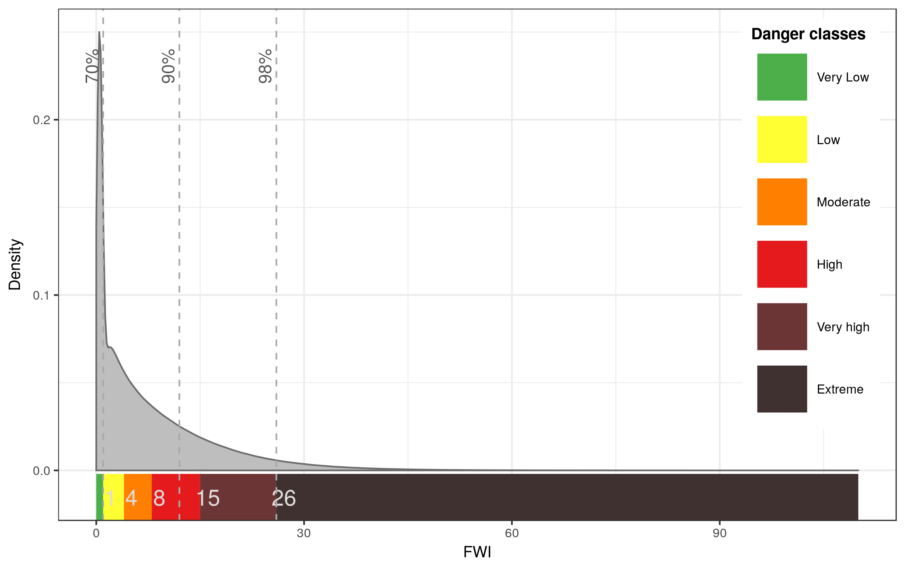
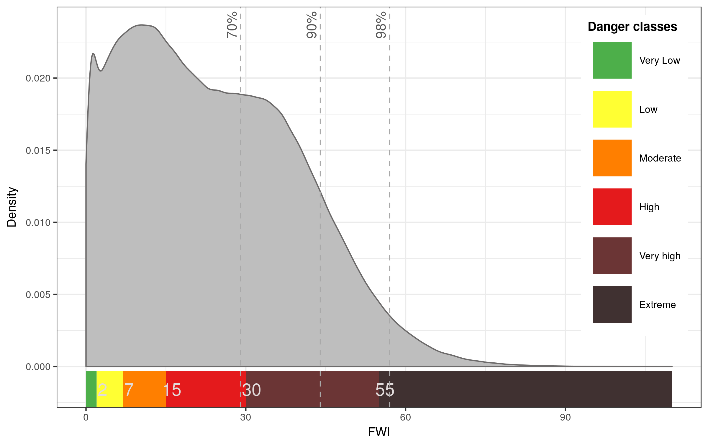
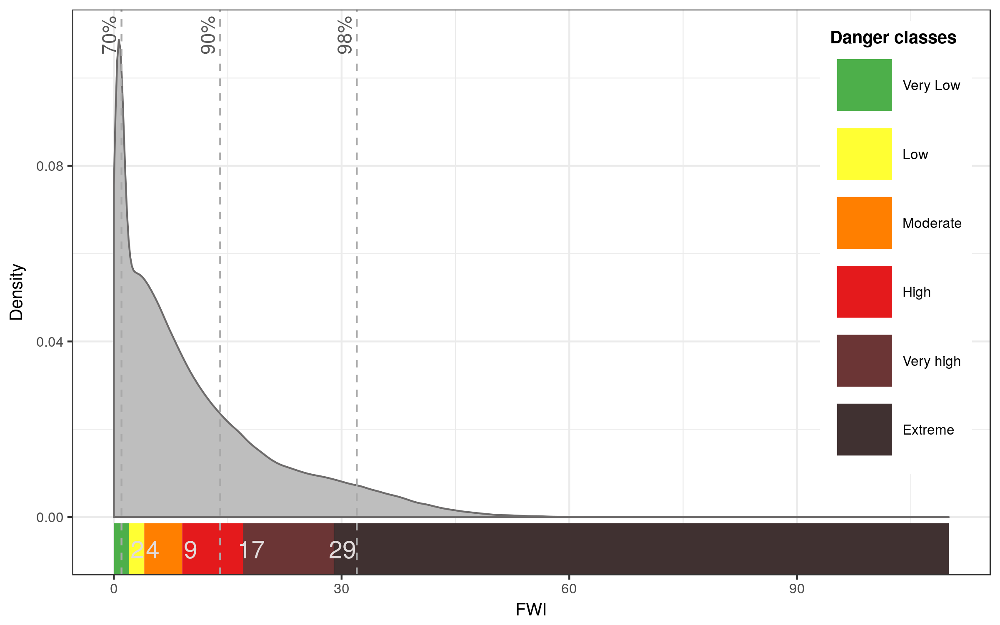
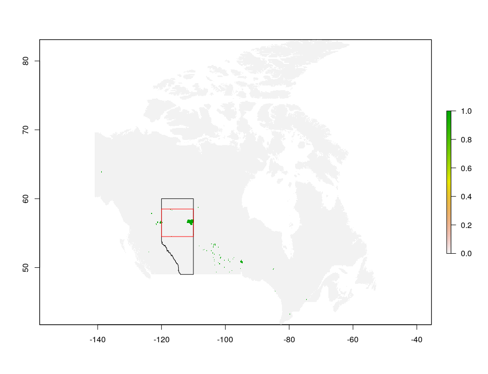
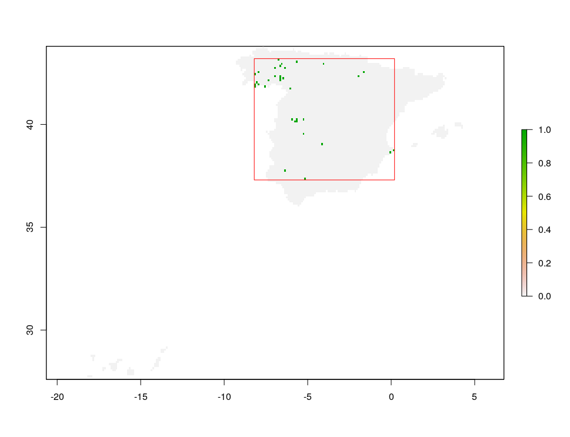
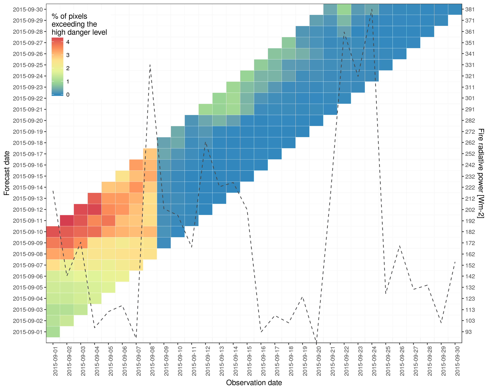

<!--
# Copyright 2016 European Centre for Medium-Range Weather Forecasts (ECMWF)
# This software is licensed under the terms of the Apache Licence Version 2.0 
# which can be obtained at http://www.apache.org/licenses/LICENSE-2.0. 
# In applying this licence, ECMWF does not waive the privileges and immunities 
# granted to it by virtue of its status as an intergovernmental organisation nor
# does it submit to any jurisdiction.
-->

```{r setup, include=FALSE}
knitr::opts_chunk$set(echo = TRUE,
                      eval = FALSE)
```

The package caliver contains functions for the calibration and verification of gridded model outputs. The package was designed with a fire risk model in mind (GEFF) but, in the near future, this is going to develop in a model agnostic tool. The introductory vignette "An introduction to the caliver package" explains in details the main functionalities of this package. The goal of this vignette, instead, is to describe how to use caliver to calculate and verify fire danger classes based on user-defined areas. This vignette contains the code to run all the analyses in [@digiuseppe:2017], please refer to this paper for more information on the methodology.

## R package caliver

For information on how to install and load caliver, please refer to the vignette "An introduction to the caliver package" and the README file in the repository.

```{r, eval = FALSE}
# Install caliver from GitHub
install.packages("devtools")
devtools::install_github("ecmwf/caliver")
```

```{r}
library("caliver")
library("raster")
library("ggplot2")
# setwd("/scratch/mo/moc0/fire/")
```

## Get data

#### Reanalysis data

For a matter of consistency with the introductory vignette, we will use the FWI as index to estimate the fire danger classes. The first step is to download (from the [GEFF-reanalysis web app](http://apps.ecmwf.int/datasets/data/geff-reanalysis/)) reanalysis data from 1980 to 2016. Assuming that data is downloaded in the folder 'reanalysis' of the working directory, we can use catNetcdf to aggregate all the files into one netcdf file (this is not necessary if you have run through the examples in the intro vignette) and load it as RasterBrick.

```{r}
# FWI reanalysis dataset
# catNetcdf(inDir = 'reanalysis', outFileName = 'FWIr_1980-2016.nc')
FWI <- raster::brick("/scratch/mo/moc0/fire/FWIr_1980-2016.nc")

# Define a vector with a sequence of dates related to the reanalysis
dataDates <- seq.Date(from = as.Date("1980-01-01"), to = as.Date("2016-12-31"),
                      by = "day")
```

#### GFED4 areas and countries of interest 

We will demonstrate how to calculate and validate fire danger levels for 4 GFED4 areas and countries: 

- Boreal North America (BONA) and Canada,
- Europe (EURO) and Spain,
- Equatorial Asia (EQAS) and Indonesia,
- Southern Hemisphere South America (SHSA) and Chile.

```{r, eval}
# GFED4 regions of interest
BONA <- getGFED4(varname = "BasisRegions", region = "BONA")
EURO <- getGFED4(varname = "BasisRegions", region = "EURO")
EQAS <- getGFED4(varname = "BasisRegions", region = "EQAS")
SHSA <- getGFED4(varname = "BasisRegions", region = "SHSA")
```

```{r, eval = TRUE}
# Countries of interest (GADM administrative boundaries)
Spain     <- raster::getData(name = "GADM", country = "Spain", level = 0)
Canada    <- raster::getData(name = "GADM", country = "Canada", level = 0)
Indonesia <- raster::getData(name = "GADM", country = "Indonesia", level = 0)
Chile     <- raster::getData(name = "GADM", country = "Chile", level = 0)
```

Plot areas and countries of interest (Fig.1).

```{r, eval = FALSE}
rtp <- BONA
rtp@data$id <- 1:nrow(rtp@data)   # add id column for join
rtpFort <- fortify(rtp, data = rtp@data)
rtpFortMer1 <- merge(rtpFort, rtp@data, by.x = "id", by.y = "id")  # join data
rtpFortMer1$Region <- "BONA"

rtp <- EURO
rtp@data$id <- 1:nrow(rtp@data)   # add id column for join
rtpFort <- fortify(rtp, data = rtp@data)
rtpFortMer2 <- merge(rtpFort, rtp@data, by.x = "id", by.y = "id")  # join data
rtpFortMer2$Region <- "EURO"

rtp <-EQAS
rtp@data$id <- 1:nrow(rtp@data)   # add id column for join
rtpFort <- fortify(rtp, data = rtp@data)
rtpFortMer3 <- merge(rtpFort, rtp@data, by.x = "id", by.y = "id")  # join data
rtpFortMer3$Region <- "EQAS"

rtp <- SHSA
rtp@data$id <- 1:nrow(rtp@data)   # add id column for join
rtpFort <- fortify(rtp, data = rtp@data)
rtpFortMer4 <- merge(rtpFort, rtp@data, by.x = "id", by.y = "id")  # join data
rtpFortMer4$Region <- "SHSA"

# Plot worldmap using data from worldmap and colour selected countries
world <- ggplot(aes(x = long, y = lat), data = map_data("world")) +
  geom_polygon(aes(group = group), fill=NA, colour = "grey65") +
  coord_equal() +  theme_bw() + xlab("Longitude") + ylab("Latitude") +
  geom_polygon(data = rtpFortMer1,
               aes(x = long, y = lat, group = group, fill = Region),
               alpha = 0.5) +
  geom_polygon(data = rtpFortMer2,
               aes(x = long, y = lat, group = group, fill = Region),
               alpha = 0.5) +
  geom_polygon(data = rtpFortMer3,
               aes(x = long, y = lat, group = group, fill = Region),
               alpha = 0.5) +
  geom_polygon(data = rtpFortMer4,
               aes(x = long, y = lat, group = group, fill = Region),
               alpha = 0.5) +
  scale_fill_manual(name="GFED4 regions",
                    values = c("#B3CDE3", "#FED9A6", "#FDDAEC", "#d8f2cd"),
                    labels = c("BONA", "EQAS", "EURO", "SHSA"))

cols <- c("Canada" = "#377EB8", "Spain" = "#F781BF", 
          "Indonesia" = "#FF7F00", "Chile" = "#75BC36")
worldcountries <- world + 
  geom_polygon(data = map_data("world", region = "Canada"),
               aes(x = long, y = lat, group = group, colour = "Canada"), 
               fill = NA) +
  geom_polygon(data = map_data("world", region = "Spain"),
               aes(x = long, y = lat, group = group, colour = "Spain"), 
               fill = NA) +
  geom_polygon(data = map_data("world", region = "Indonesia"),
               aes(x = long, y = lat, group = group, colour = "Indonesia"), 
               fill = NA) +
  geom_polygon(data = map_data("world", region = "Chile"),
               aes(x = long, y = lat, group = group, colour = "Chile"), 
               fill = NA) +
  scale_colour_manual(name = "Countries", values = cols)

worldcountries
```

```{r, echo = FALSE, eval = FALSE}
ggsave(file="Fig1.eps", plot= worldcountries,
       device = cairo_ps, fallback_resolution = 600,
       width=unit(8, "in"), height=unit(5, "in"))
```


## Calculate fire danger classes by GFED4 areas and countries

Define fire seasons for the three cases: north and south hemispheres, and tropics.

```{r}
# Extract fire seasons for the northern emisphere
seasonsN <- getFireSeason(DATES = dataDates, zone = "north")
# Create Fire Season Indices (FSI)
northFSI <- which(seasonsN == TRUE)

# Extract fire seasons for the southern emisphere
seasonsS <- getFireSeason(DATES = dataDates, zone = "south")
# Create Fire Season Indices (FSI)
southFSI <- which(seasonsS == TRUE)

# Extract fire seasons for the tropics
seasonsT <- getFireSeason(DATES = dataDates, zone = "tropics")
# Create Fire Season Indices (FSI)
tropicFSI <- which(seasonsT == TRUE)

# Initialise empty matrix to store thresholds
df <- matrix(data = NA, nrow = 0, ncol = 7)
```

Calculate fire danger classes as shown in the introductory vignette.

```{r}
# Mask/Crop/Subset FWI and generate thresholds for BONA & Canada
region <- BONA
regionR <- maskcropsub(r = FWI, p = region, mask = T, crop = T,
                       i2subset = northFSI)
df <- rbind(df, c("BONA", 0, FireDangerLevels(fireIndex = regionR)))

country <- Canada
countryFWI <- maskcropsub(r = FWI, p = country, mask = T, crop = T,
                        i2subset = northFSI)
df <- rbind(df, c(country$NAME_ENGLISH, 0, 
                  FireDangerLevels(fireIndex = countryFWI)))

percs <- round(quantile(na.omit(as.vector(countryFWI)), 
                        probs = c(0.70, 0.90, 0.98)), 0)

# Density plot with thresholds
CanadaPDF <- plotPDF(fireIndex = countryFWI,
                     thresholds = as.numeric(df[which(df[,1]==                                                          country$NAME_ENGLISH), 3:7]),
                     upperLimit = 110, vLines = percs)
CanadaPDF
```

```{r, echo = FALSE, eval = FALSE}
# For publication
ggsave(file = paste0(country$NAME_ENGLISH, "PDF.eps"),
       plot = CanadaPDF, width=unit(8, "in"), height=unit(5, "in"))
# For HTML vignette
ggsave(file = paste0(country$NAME_ENGLISH, "PDF.png"),
       plot = CanadaPDF, width=unit(8, "in"), height=unit(5, "in"))
```



```{r}
# Mask/Crop/Subset FWI and generate thresholds for EURO/Spain
region <- EURO
regionR <- maskcropsub(r = FWI, p = region, mask = T, crop = T,
                       i2subset = northFSI)
df <- rbind(df, c("EURO", 0, FireDangerLevels(fireIndex = regionR)))

country <- Spain
countryFWI <- maskcropsub(r = FWI, p = country, mask = T, crop = T,
                          i2subset = northFSI)
df <- rbind(df, c(country$NAME_ENGLISH, 0,
                  FireDangerLevels(fireIndex = countryFWI)))

percs <- round(quantile(na.omit(as.vector(countryFWI)), 
                        probs = c(0.70, 0.90, 0.98)), 0)

# Density plot with thresholds
SpainPDF <- plotPDF(fireIndex = countryFWI,
                    thresholds = as.numeric(df[which(df[,1]==                                                         country$NAME_ENGLISH), 3:7]),
                    upperLimit = 110, vLines = percs)
SpainPDF
```

```{r, echo = FALSE, eval = FALSE}
# For publication
ggsave(file = paste0(country$NAME_ENGLISH, "PDF.eps"),
       plot = SpainPDF, width=unit(8, "in"), height=unit(5, "in"))
# For HTML vignette
ggsave(file = paste0(country$NAME_ENGLISH, "PDF.png"),
       plot = SpainPDF, width=unit(8, "in"), height=unit(5, "in"))
```



```{r}
# Mask/Crop/Subset FWI and generate thresholds for EQAS/Indonesia
region <- EQAS
regionR <- maskcropsub(r = FWI, p = region, mask = T, crop = T,
                       i2subset = tropicFSI)
df <- rbind(df, c("EQAS", 0, FireDangerLevels(fireIndex = regionR)))

country <- Indonesia
countryFWI <- maskcropsub(r = FWI, p = country, mask = T, crop = T,
                          i2subset = tropicFSI)
df <- rbind(df, c(country$NAME_ENGLISH, 0,
                  FireDangerLevels(fireIndex = countryFWI)))

percs <- round(quantile(na.omit(as.vector(countryFWI)), 
                        probs = c(0.70, 0.90, 0.98)), 0)

# Density plot with thresholds
IndonesiaPDF <- plotPDF(fireIndex = countryFWI,
                    thresholds = as.numeric(df[which(df[,1]==                                                         country$NAME_ENGLISH), 3:7]),
                    upperLimit = 110, vLines = percs)
IndonesiaPDF
```

```{r, echo = FALSE, eval = FALSE}
# For publication
ggsave(file = paste0(country$NAME_ENGLISH, "PDF.eps"),
       plot = IndonesiaPDF, width=unit(8, "in"), height=unit(5, "in"))
# For HTML vignette
ggsave(file = paste0(country$NAME_ENGLISH, "PDF.png"),
       plot = IndonesiaPDF, width=unit(8, "in"), height=unit(5, "in"))
```



```{r}
# Mask/Crop/Subset FWI and generate thresholds for SHSA/Chile
region <- SHSA
regionR <- maskcropsub(r = FWI, p = region, mask = T, crop = T, 
                       i2subset = southFSI)
df <- rbind(df, c("SHSA", 0, FireDangerLevels(fireIndex = regionR)))

country <- Chile
countryFWI <- maskcropsub(r = FWI, p = country, mask = T, crop = T,
                        i2subset = southFSI)
df <- rbind(df, c(country$NAME_ENGLISH, 0,
                  FireDangerLevels(fireIndex = countryFWI)))

percs <- round(quantile(na.omit(as.vector(countryFWI)), 
                        probs = c(0.70, 0.90, 0.98)), 0)

# Density plot with thresholds
ChilePDF <- plotPDF(fireIndex = countryFWI,
                    thresholds = as.numeric(df[which(df[,1]==                                                         country$NAME_ENGLISH), 3:7]),
                    upperLimit = 110, vLines = percs)
ChilePDF
```

```{r, echo = FALSE, eval = FALSE}
# For publication
ggsave(file = paste0(country$NAME_ENGLISH, "PDF.eps"),
       plot = ChilePDF, width=unit(8, "in"), height=unit(5, "in"))
# For HTML vignette
ggsave(file = paste0(country$NAME_ENGLISH, "PDF.png"),
       plot = ChilePDF, width=unit(8, "in"), height=unit(5, "in"))
```


```{r, echo = FALSE}
# Combine the PDF plots for publication (by the end I used the single plots).
# Source: 
# https://stackoverflow.com/questions/13649473/add-a-common-legend-for-combined-ggplots
library(gridExtra)

# Extract legend
#https://github.com/hadley/ggplot2/wiki/Share-a-legend-between-two-ggplot2-graphs
g_legend<-function(a.gplot){
  tmp <- ggplot_gtable(ggplot_build(a.gplot))
  leg <- which(sapply(tmp$grobs, function(x) x$name) == "guide-box")
  legend <- tmp$grobs[[leg]]
  return(legend)
}

mylegend<-g_legend(CanadaPDF)

p1 <- CanadaPDF + 
  theme(legend.position="none") + 
  ggtitle("Canada") + theme(plot.title = element_text(hjust = 0.5))
p2 <- SpainPDF + 
  theme(legend.position="none") + 
  ggtitle("Spain") + theme(plot.title = element_text(hjust = 0.5))
p3 <- IndonesiaPDF + 
  theme(legend.position="none") + 
  ggtitle("Indonesia") + theme(plot.title = element_text(hjust = 0.5))
p4 <- ChilePDF + 
  theme(legend.position="none") + 
  ggtitle("Chile") + theme(plot.title = element_text(hjust = 0.5))

p <- grid.arrange(arrangeGrob(p1, p2, p3, p4, nrow=2), mylegend, ncol=1, widths = c(10, 10, 1))
```


```{r}
# Convert matrix to data frame, assign column names and save
df <- data.frame(df, stringsAsFactors = FALSE)
names(df) <- c("Area", "VeryLow", "Low", "Moderate", 
               "High", "VeryHigh", "Extreme")
```

```{r, eval = TRUE, echo = FALSE}
# saveRDS(df, "thresholds.rds")
df <- readRDS("/scratch/mo/moc0/fire/thresholds.rds")
knitr::kable(df[1:8,], row.names = FALSE)
```

## Verify fire danger classes

The following four events were selected to verify the previously calculated danger classes:

  * Indonesia	2015-09-10	2015-09-24	
  * Canada	2016-05-01	2016-05-15 (Alberta's region)
  * Spain	2016-08-28	2016-09-11	 
  * Chile	2017-01-15	2017-01-29
  
In order to find the actual area affected by fires (for each of the above events), we follow the steps below:

  1. Get Fire Radiative Power from CAMS observations using the bash script [CAMS_GFAS_Observations.sh](https://software.ecmwf.int/stash/projects/CEMSF/repos/fire_utilities/browse/sh/CAMS_GFAS_Observations.sh):
     `sh CAMS_Observations.sh`. This generates the file: CAMS_**TimeWindow**_frpfire_rotated.nc
  2. Load the file above as RasterBrick
  3. Sum all the FRP over time
  4. If there are many small fires, we can set a threshold of minimum radiative power to be considered. Convert layer info to binary: 1 if FRP > 0.5, 0 otherwise
  5. Plot to check maximum extension
  6. Remove zeros and create a bounding box (fireBBOX) including only cells = 1
  
Once the affected area has been identified, we use this to verify the forecast with the observed fire radiative power.

Forecast data is obtained by using the bash scripts: [GEFF_Forecast.sh](https://software.ecmwf.int/stash/projects/CEMSF/repos/fire_utilities/browse/sh/GEFF_Forecast.sh): `sh GEFF_Forecast.sh`. This generates one file per forecast day: **StartDate**_**EndDate**_ecfire_fwi_fwi.nc

The code below shows how to perform the verification for the 4 events. 
  
#### Canada

Numerous wildfire in the Alberta region (Canada) were reported in May 2016. 

```{r}
Alberta <- raster::getData(name = "GADM", 
                           country = "Canada", 
                           level = 1)
Alberta <- Alberta[which(Alberta$NAME_1 == "Alberta"),]
```

```{r}
subRegion <- Alberta
subRegionFWI <- maskcropsub(r = FWI, p = subRegion, mask = T, crop = T,
                            i2subset = northFSI)
df <- as.matrix(df)
df <- rbind(df, c(subRegion$NAME_1, 0, FireDangerLevels(fireIndex = subRegionFWI)))
df <- data.frame(df, stringsAsFactors = FALSE)
df
```

In the table below we compare the danger levels at large scale, national and regional level.

```{r, eval = TRUE, echo = FALSE}
# saveRDS(df, "thresholds.rds")
knitr::kable(df[c(1,2,9),], row.names = FALSE)
```

```{r}
# 2. Load the frp file as RasterBrick:
startDate <- "2016-05-01"
endDate <- "2016-05-31"
x <- raster::brick(paste0("/scratch/mo/moc0/fire/events/CAMS_",
                          startDate, "_", endDate, "_frpfire_rotated.nc"))

# 3. Sum all the FRP over time
xsum <- raster::calc(x, sum)

# 4. Convert layer info to binary: 1 if FRP > 0.5, 0 otherwise
xsum[xsum > 0.5] <- 1
xsum[xsum <= 0.5] <- 0
raster::plot(maskcropsub(r = xsum, p = Canada, mask = TRUE, crop = TRUE))
raster::plot(Alberta, add = TRUE)

# 5-6. Remove zeros and create a bounding box including only cells = 1
xsum[xsum == 0] <- NA
fireBBOX <- as(raster::extent(raster::trim(maskcropsub(r = xsum, 
                                                       p = Alberta, 
                                                       mask = TRUE, 
                                                       crop = TRUE))), 
               'SpatialPolygons')
raster::plot(fireBBOX, border = "red", add = TRUE)
```



In the figure above Canada is shaded in gray, Alberta is identified by the black polygon while the areas in green show the most important fire activities. If we focus on the Alberta region, the most important fire activities are enclosed in the red polygon (called fireBBOX hereafter). 

At this point we compare the fire activities in the fireBBOX with the high danger level calculated previously for Canada.

```{r}
CanadaFRP <- plotOBSvsForecast(inDir = "GEFF1.2/forecast", 
                               areaOfInterest = fireBBOX, 
                               threshold = as.numeric(df$High[df$Area == "Canada"]), 
                               startDate = startDate, endDate = endDate,
                               obsFilePath = paste0("events/CAMS_", 
                                                    startDate, "_", endDate, 
                                                    "_frpfire_rotated.nc"))
CanadaFRP
```

```{r, echo = FALSE, eval = FALSE}
# For publication
ggsave(file = "/scratch/mo/moc0/fire/CanadaFRP.eps",
       plot = CanadaFRP, width=unit(10, "in"), height=unit(8, "in"))
# For HTML vignette
ggsave(file = "/scratch/mo/moc0/fire/CanadaFRP.png",
       plot = CanadaFRP, width=unit(10, "in"), height=unit(8, "in"))
```


#### Spain

Numerous wildfire in Spain were reported in August-September 2016. In the table below we compare the danger levels at large scale and national level.

```{r, eval = TRUE, echo = FALSE}
knitr::kable(df[c(3,4),], row.names = FALSE)
```

```{r}
# 2. Load the frp file as RasterBrick:
startDate <- "2016-08-19"
endDate <- "2016-09-18"
x <- raster::brick(paste0("/scratch/mo/moc0/fire/events/CAMS_",
                          startDate, "_", endDate, "_frpfire_rotated.nc"))

# 3. Sum all the FRP over time
xsum <- raster::calc(x, sum)

# 4. Convert layer info to binary: 1 if FRP > 0.5, 0 otherwise
xsum[xsum > 0.5] <- 1
xsum[xsum <= 0.5] <- 0
raster::plot(maskcropsub(r = xsum, p = Spain, mask = TRUE, crop = TRUE))

# 5-6. Remove zeros and create a bounding box including only cells = 1
xsum[xsum == 0] <- NA
fireBBOX <- as(raster::extent(raster::trim(maskcropsub(r = xsum, 
                                                       p = Spain, 
                                                       mask = TRUE, 
                                                       crop = TRUE))), 
               'SpatialPolygons')
raster::plot(fireBBOX, border = "red", add = TRUE)
```



In the figure above Spain is shaded in gray while the areas in green show the most important fire activities(fireBBOX), which we compare below with the high danger level calculated previously for Spain.

```{r}
SpainFRP <- plotOBSvsForecast(inDir = "GEFF1.2/forecast", 
                              areaOfInterest = fireBBOX, 
                              threshold = as.numeric(df$High[df$Area == "Spain"]), 
                              startDate = startDate, endDate = endDate,
                              obsFilePath = paste0("events/CAMS_", 
                                                   startDate, "_", endDate, 
                                                   "_frpfire_rotated.nc"))
SpainFRP
```

```{r, echo = FALSE, eval = FALSE}
# For publication
ggsave(file = "/scratch/mo/moc0/fire/SpainFRP.eps",
       plot = SpainFRP, width=unit(10, "in"), height=unit(8, "in"))
# For HTML vignette
ggsave(file = "/scratch/mo/moc0/fire/SpainFRP.png",
       plot = SpainFRP, width=unit(10, "in"), height=unit(8, "in"))
```


#### Indonesia

Numerous wildfire in Indonesia were reported from August to October 2015, but we will only look at September 2015 here. In the table below we compare the danger levels at large scale and national level.

```{r, eval = TRUE, echo = FALSE}
knitr::kable(df[c(5,6),], row.names = FALSE)
```

```{r}
# 2. Load the frp file as RasterBrick:
startDate <- "2015-09-01"
endDate <- "2015-09-30"
x <- raster::brick(paste0("/scratch/mo/moc0/fire/events/CAMS_",
                          startDate, "_", endDate, "_frpfire_rotated.nc"))

# 3. Sum all the FRP over time
xsum <- raster::calc(x, sum)

# 4. Convert layer info to binary: 1 if FRP > 0.5, 0 otherwise
xsum[xsum > 0.5] <- 1
xsum[xsum <= 0.5] <- 0
raster::plot(maskcropsub(r = xsum, p = Indonesia, mask = TRUE, crop = TRUE))

# 5-6. Remove zeros and create a bounding box including only cells = 1
xsum[xsum == 0] <- NA
fireBBOX <- as(raster::extent(raster::trim(maskcropsub(r = xsum, 
                                                       p = Indonesia, 
                                                       mask = TRUE, 
                                                       crop = TRUE))), 
               'SpatialPolygons')
raster::plot(fireBBOX, border = "red", add = TRUE)
```


In the figure above Indonesia is shaded in gray while the areas in green show the most important fire activities(fireBBOX), which we compare below with the high danger level calculated previously for Indonesia.

```{r}
IndonesiaFRP <- plotOBSvsForecast(inDir = "GEFF1.2/forecast", 
                                  areaOfInterest = fireBBOX, 
                                  threshold = as.numeric(df$High[df$Area == "Indonesia"]), 
                                  startDate = startDate, endDate = endDate,
                                  obsFilePath = paste0("events/CAMS_", 
                                                       startDate, "_", endDate,
                                                       "_frpfire_rotated.nc"))
IndonesiaFRP
```

```{r, echo = FALSE, eval = FALSE}
# For publication
ggsave(file = "/scratch/mo/moc0/fire/IndonesiaFRP.eps",
       plot = IndonesiaFRP, width=unit(10, "in"), height=unit(8, "in"))
# For HTML vignette
ggsave(file = "/scratch/mo/moc0/fire/IndonesiaFRP.png",
       plot = IndonesiaFRP, width=unit(10, "in"), height=unit(8, "in"))
```



#### Chile

Numerous wildfire in Chile were reported in January 2017. In the table below we compare the danger levels at large scale and national level.

```{r, eval = TRUE, echo = FALSE}
knitr::kable(df[c(7,8),], row.names = FALSE)
```

```{r}
# 2. Load the frp file as RasterBrick:
startDate <- "2017-01-01"
endDate <- "2017-01-31"
x <- raster::brick(paste0("/scratch/mo/moc0/fire/events/CAMS_",
                          startDate, "_", endDate, "_frpfire_rotated.nc"))

# 3. Sum all the FRP over time
xsum <- raster::calc(x, sum)

# 4. Convert layer info to binary: 1 if FRP > 0.5, 0 otherwise
xsum[xsum > 0.5] <- 1
xsum[xsum <= 0.5] <- 0 # extra step to plot pixels <= 0.5 as gray background
raster::plot(maskcropsub(r = xsum, p = Chile, mask = TRUE, crop = TRUE))

# 5-6. Remove zeros and create a bounding box including only cells = 1
xsum[xsum == 0] <- NA
fireBBOX <- as(raster::extent(raster::trim(maskcropsub(r = xsum, 
                                                       p = Chile, 
                                                       mask = TRUE, 
                                                       crop = TRUE))), 
               'SpatialPolygons')
raster::plot(fireBBOX, border = "red", add = TRUE)
```


In the figure above Chile is shaded in gray while the areas in green show the most important fire activities(fireBBOX), which we compare below with the high danger level calculated previously for Chile.

```{r}
ChileFRP <- plotOBSvsForecast(inDir = "GEFF1.2/forecast", 
                              areaOfInterest = fireBBOX, 
                              threshold = as.numeric(df$High[df$Area == "Chile"]), 
                              startDate = startDate, endDate = endDate,
                              obsFilePath = paste0("events/CAMS_", 
                                                   startDate, "_", endDate, 
                                                   "_frpfire_rotated.nc"))
ChileFRP
```

```{r, echo = FALSE, eval = FALSE}
# For publication
ggsave(file = "/scratch/mo/moc0/fire/ChileFRP.eps",
       plot = ChileFRP, width=unit(10, "in"), height=unit(8, "in"))
# For HTML vignette
ggsave(file = "/scratch/mo/moc0/fire/ChileFRP.png",
       plot = ChileFRP, width=unit(10, "in"), height=unit(8, "in"))
```


## Scores

Let's take a large area, such as Canada. The advantage of using the above danger levels over the continuous values is that we have a better correspondance between hit rate and false alarms.

For the fire in Canada, the peak in radiative power was obtained on the 2015-06-16. To calculate the scores I need to collect the forecasts of the previous 10 days and compare fwi and frp. 

```{r, eval = TRUE}
library("verification")
x <- c()

# DAY 10
fwiR <- raster::raster("GEFF1.2/forecast/20160507_20160516_ecfire_fwi_fwi.nc")
if (round(fwiR@extent@xmin, 0) == 0) fwiR <- raster::rotate(fwiR)
fwi <- maskcropsub(r = fwiR, p = Canada, mask = TRUE, crop = FALSE)
fwi_v <- as.vector(fwi)
fwi_v[fwi_v < 9] <- FALSE
fwi_v[fwi_v >= 9] <- TRUE

frpR <- raster::brick("events/CAMS_2016-05-01_2016-05-31_frpfire_rotated.nc")
if (round(frpR@extent@xmin, 0) == 0) frpR <- raster::rotate(frpR)
frp <- maskcropsub(r = frpR, p = Canada, mask = TRUE, crop = FALSE, 
                   i2subset = 16)
frp_resampled_temp <- raster::resample(x = frp, y = fwi, progress = 'text')
frp_resampled <- as.vector(frp_resampled_temp)
frp_resampled[frp_resampled < 0.5] <- FALSE
frp_resampled[frp_resampled >= 0.5] <- TRUE

A <- verify(obs = frp_resampled, pred = fwi_v,
            frcst.type = "binary", obs.type = "binary")
x <- c(x, A$POD) # 0

# DAY 9
fwiR <- raster::raster("GEFF1.2/forecast/20160508_20160516_ecfire_fwi_fwi.nc")
if (round(fwiR@extent@xmin, 0) == 0) fwiR <- raster::rotate(fwiR)
fwi <- caliver::maskcropsub(r = fwiR, p = Canada, mask = TRUE, crop = FALSE)
fwi_v <- as.vector(fwi)
fwi_v[fwi_v < 9] <- FALSE
fwi_v[fwi_v >= 9] <- TRUE
A <- verify(obs = frp_resampled, pred = fwi_v,
            frcst.type = "binary", obs.type = "binary")
x <- c(x, A$POD) # 0

# DAY 8
fwiR <- raster::raster("GEFF1.2/forecast/20160509_20160516_ecfire_fwi_fwi.nc")
if (round(fwiR@extent@xmin, 0) == 0) fwiR <- raster::rotate(fwiR)
fwi <- caliver::maskcropsub(r = fwiR, p = Canada, mask = TRUE, crop = FALSE)
fwi_v <- as.vector(fwi)
fwi_v[fwi_v < 9] <- FALSE
fwi_v[fwi_v >= 9] <- TRUE
A <- verify(obs = frp_resampled, pred = fwi_v,
            frcst.type = "binary", obs.type = "binary")
x <- c(x, A$POD) # 0

# DAY 7
fwiR <- raster::raster("GEFF1.2/forecast/20160510_20160516_ecfire_fwi_fwi.nc")
if (round(fwiR@extent@xmin, 0) == 0) fwiR <- raster::rotate(fwiR)
fwi <- caliver::maskcropsub(r = fwiR, p = Canada, mask = TRUE, crop = FALSE)
fwi_v <- as.vector(fwi)
fwi_v[fwi_v < 9] <- FALSE
fwi_v[fwi_v >= 9] <- TRUE
A <- verify(obs = frp_resampled, pred = fwi_v, #baseline = climatology,
            frcst.type = "binary", obs.type = "binary")
x <- c(x, A$POD) # 0.25

# DAY 6
fwiR <- raster::raster("GEFF1.2/forecast/20160511_20160516_ecfire_fwi_fwi.nc")
if (round(fwiR@extent@xmin, 0) == 0) fwiR <- raster::rotate(fwiR)
fwi <- caliver::maskcropsub(r = fwiR, p = Canada, mask = TRUE, crop = FALSE)
fwi_v <- as.vector(fwi)
fwi_v[fwi_v < 9] <- FALSE
fwi_v[fwi_v >= 9] <- TRUE
A <- verify(obs = frp_resampled, pred = fwi_v, #baseline = climatology,
            frcst.type = "binary", obs.type = "binary")
x <- c(x, A$POD) # 0

# DAY 5
fwiR <- raster::raster("GEFF1.2/forecast/20160512_20160516_ecfire_fwi_fwi.nc")
if (round(fwiR@extent@xmin, 0) == 0) fwiR <- raster::rotate(fwiR)
fwi <- caliver::maskcropsub(r = fwiR, p = Canada, mask = TRUE, crop = FALSE)
fwi_v <- as.vector(fwi)
fwi_v[fwi_v < 9] <- FALSE
fwi_v[fwi_v >= 9] <- TRUE
A <- verify(obs = frp_resampled, pred = fwi_v, #baseline = climatology,
            frcst.type = "binary", obs.type = "binary")
x <- c(x, A$POD) # 0

# DAY 4
fwiR <- raster::raster("GEFF1.2/forecast/20160513_20160516_ecfire_fwi_fwi.nc")
if (round(fwiR@extent@xmin, 0) == 0) fwiR <- raster::rotate(fwiR)
fwi <- caliver::maskcropsub(r = fwiR, p = Canada, mask = TRUE, crop = FALSE)
fwi_v <- as.vector(fwi)
fwi_v[fwi_v < 9] <- FALSE
fwi_v[fwi_v >= 9] <- TRUE
A <- verify(obs = frp_resampled, pred = fwi_v, #baseline = climatology,
            frcst.type = "binary", obs.type = "binary")
x <- c(x, A$POD) # 0

# DAY 3
fwiR <- raster::raster("GEFF1.2/forecast/20160514_20160516_ecfire_fwi_fwi.nc")
if (round(fwiR@extent@xmin, 0) == 0) fwiR <- raster::rotate(fwiR)
fwi <- caliver::maskcropsub(r = fwiR, p = Canada, mask = TRUE, crop = FALSE)
fwi_v <- as.vector(fwi)
fwi_v[fwi_v < 9] <- FALSE
fwi_v[fwi_v >= 9] <- TRUE
A <- verify(obs = frp_resampled, pred = fwi_v, #baseline = climatology,
            frcst.type = "binary", obs.type = "binary")
x <- c(x, A$POD) # 0

# DAY 2
fwiR <- raster::raster("GEFF1.2/forecast/20160515_20160516_ecfire_fwi_fwi.nc")
if (round(fwiR@extent@xmin, 0) == 0) fwiR <- raster::rotate(fwiR)
fwi <- caliver::maskcropsub(r = fwiR, p = Canada, mask = TRUE, crop = FALSE)
fwi_v <- as.vector(fwi)
fwi_v[fwi_v < 9] <- FALSE
fwi_v[fwi_v >= 9] <- TRUE
A <- verify(obs = frp_resampled, pred = fwi_v, #baseline = climatology,
            frcst.type = "binary", obs.type = "binary")
x <- c(x, A$POD) # 0

# DAY 1
fwiR <- raster::raster("GEFF1.2/forecast/20160516_20160516_ecfire_fwi_fwi.nc")
if (round(fwiR@extent@xmin, 0) == 0) fwiR <- raster::rotate(fwiR)
fwi <- caliver::maskcropsub(r = fwiR, p = Canada, mask = TRUE, crop = FALSE)
fwi_v <- as.vector(fwi)
fwi_v[fwi_v < 9] <- FALSE
fwi_v[fwi_v >= 9] <- TRUE
A <- verify(obs = frp_resampled, pred = fwi_v, #baseline = climatology,
            frcst.type = "binary", obs.type = "binary")
x <- c(x, A$POD) # 0
```

```{r, eval = TRUE, fig.width=10}
df <- data.frame("POD" = x, "Day" = seq(10, 1))

ggplot(df, aes(Day, POD)) + geom_point() + geom_line() +
  ggtitle("POD decrease with lead time") +
  theme(plot.title = element_text(hjust = 0.5)) +
  ylim(0, 1)
```
